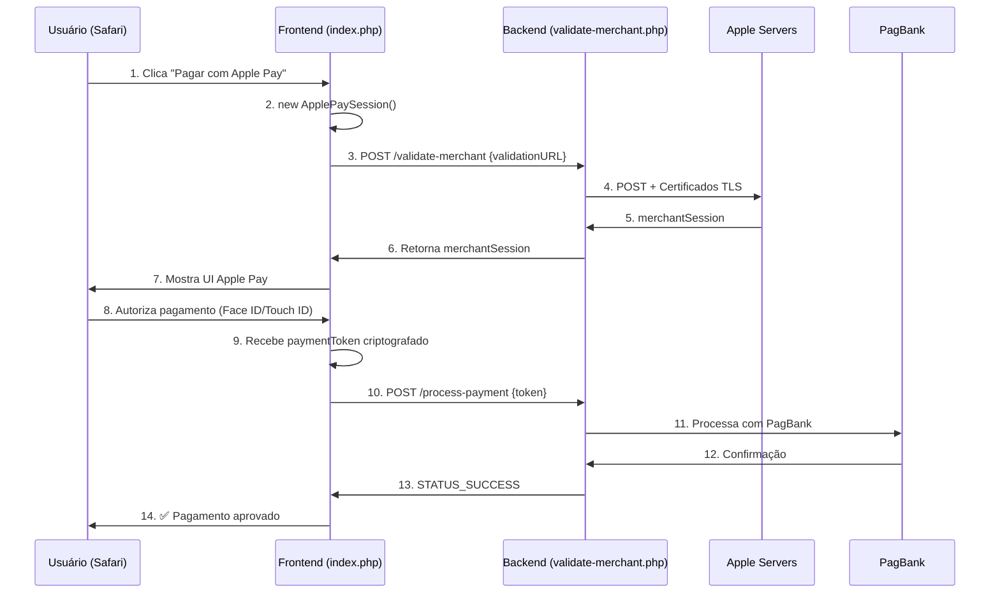

# 🍎 Integração Apple Pay - Documentação Completa

Este projeto implementa a integração completa do Apple Pay com validação de merchant server-to-server e processamento de pagamentos.

---

## 📚 Documentação

### 🚀 Para Começar

**1. [Início Rápido](INICIO-RAPIDO.md)** ⭐  
Guia para colocar o Apple Pay funcionando em 5 passos rápidos.

**2. [Guia Completo de Certificados](GUIA-CERTIFICADOS-APPLE-PAY.md)** 🔐  
Passo a passo detalhado para gerar os certificados `.pem` no Apple Developer Console.

**3. [Configuração Avançada](README-CONFIGURACAO.md)** ⚙️  
Informações técnicas sobre a configuração do endpoint de validação.

---

## 🗂️ Estrutura do Projeto

```
Integração Apple Pay/
│
├── 📄 README.md                              ← Você está aqui
├── 🚀 INICIO-RAPIDO.md                       ← Comece aqui!
├── 🔐 GUIA-CERTIFICADOS-APPLE-PAY.md         ← Como gerar certificados
├── ⚙️  README-CONFIGURACAO.md                ← Configuração técnica
│
├── 🌐 index.php                              ← Frontend (Apple Pay JS)
├── 🔧 validate-merchant.php                  ← Backend (validação merchant)
├── ✅ verificar-certificados.php             ← Script de verificação
├── 🧪 test-config.php                        ← Teste de configuração
├── 🧪 test-ngrok.php                         ← Teste de conexão
│
├── 🔒 certs/                                 ← Certificados Apple Pay
│   ├── README.md
│   ├── apple_pay_cert.pem                    (você vai gerar)
│   └── apple_pay_key.pem                     (você vai gerar)
│
└── 🚫 .gitignore                             ← Proteção dos certificados
```

---

## ⚡ Quick Start

### 1. Gerar Certificados

Siga o **[Guia de Certificados](GUIA-CERTIFICADOS-APPLE-PAY.md)** para:
- Criar Merchant ID no Apple Developer
- Gerar CSR e certificados
- Converter para formato `.pem`

### 2. Verificar Configuração

```bash
php verificar-certificados.php
```

### 3. Testar

```bash
# Terminal 1
php -S localhost:8000

# Terminal 2
ngrok http 8000
```

Acesse a URL HTTPS do ngrok no Safari!

---

## 🔐 Sobre os Certificados

### Tipos de Certificados

| Certificado | Obrigatório? | Para que serve? |
|-------------|--------------|-----------------|
| **Merchant Identity** | ✅ Sim | Validar merchant com Apple |
| **Payment Processing** | ❌ Opcional | Descriptografar token (PagBank faz isso) |

### Arquivos Necessários

```
certs/
├── apple_pay_cert.pem    # Certificado público (da Apple)
└── apple_pay_key.pem     # Chave privada (gerada por você)
```

**⚠️ NUNCA faça commit desses arquivos!** Eles já estão no `.gitignore`.

---

## 🔄 Fluxo do Apple Pay



---

## 🛠️ Scripts Disponíveis

### verificar-certificados.php ✅ **[RECOMENDADO]**

Script completo de verificação:

```bash
php verificar-certificados.php
```

**Verifica:**
- ✅ Existência dos arquivos
- ✅ Permissões corretas (600)
- ✅ Formato PEM válido
- ✅ Validade do certificado
- ✅ Compatibilidade certificado + chave
- ✅ Configuração do validate-merchant.php
- ✅ Extensões PHP necessárias

### test-config.php

Teste básico de configuração:

```bash
php test-config.php
```

### test-ngrok.php

Testa conexão com endpoint remoto:

```bash
php test-ngrok.php
```

---

## 🧪 Ambiente de Desenvolvimento

### Requisitos

- PHP 7.4+ (com cURL e OpenSSL)
- Safari (desktop ou mobile)
- Conta Apple Developer ($99/ano)
- HTTPS (use ngrok para testes locais)

### Configurar HTTPS Local com ngrok

```bash
# 1. Instalar ngrok (se não tiver)
brew install ngrok  # Mac
# ou baixe em https://ngrok.com/download

# 2. Iniciar servidor PHP
php -S localhost:8000

# 3. Expor via HTTPS
ngrok http 8000

# 4. Copiar URL HTTPS
# https://abc123.ngrok-free.app
```

---

## 📝 Configuração

### validate-merchant.php

Edite as linhas 70-76:

```php
$merchantIdentifier = 'merchant.adoorei';           // ← Seu Merchant ID
$displayName = 'Loja Teste';                        // ← Nome da loja

// Domínio usado na validação Apple Pay (precisa estar cadastrado no Merchant ID)
$requestHost = $_SERVER['HTTP_HOST'] ?? 'localhost';
$domainName = getenv('APPLE_PAY_DOMAIN') ?: preg_replace('/:\\d+$/', '', strtolower($requestHost));
```

- Defina `APPLE_PAY_DOMAIN` se quiser forçar um domínio específico (ex.: o da loja em produção).
Para chaves privadas com senha, defina `APPLE_PAY_KEY_PASSPHRASE` com a mesma senha usada ao exportar o `.p12`.

- Defina `APPLE_PAY_DOMAIN` se quiser forçar um domínio específico (ex.: o da loja em produção).
- Caso contrário, o script usa automaticamente o host da requisição (útil para testes com ngrok).

### index.php

O endpoint de validação já está configurado (linha 71):

```javascript
const VALIDATE_ENDPOINT = './validate-merchant.php';
```

---

## 🆘 Troubleshooting

### ❌ "Apple Pay não suportado"

**Causas:**
- Browser não é Safari
- Apple Pay não configurado no dispositivo
- URL não é HTTPS

**Solução:**
- Use Safari no iPhone/iPad/Mac
- Configure um cartão no Apple Wallet
- Use ngrok para HTTPS

---

### ❌ "Certificado não encontrado"

**Causas:**
- Arquivos `.pem` não estão na pasta `certs/`
- Nomes dos arquivos incorretos

**Solução:**
```bash
ls certs/*.pem
# Deve mostrar:
# certs/apple_pay_cert.pem
# certs/apple_pay_key.pem
```

Se não aparecer, siga o **[Guia de Certificados](GUIA-CERTIFICADOS-APPLE-PAY.md)**.

---

### ❌ "Merchant validation failed"

**Causas:**
- Merchant ID incorreto
- Domínio não registrado no Apple Developer
- Certificados expirados

**Solução:**
```bash
# 1. Verificar certificados
php verificar-certificados.php

# 2. Conferir Merchant ID
# Deve ser EXATAMENTE igual ao registrado na Apple
```

### ❌ "Load failed" ou erro cURL

**Causas comuns:**
- Certificado expirado ou com data de validade futura (relógio do servidor errado)
- Chave privada protegida por senha sem `APPLE_PAY_KEY_PASSPHRASE`
- Certificados/arquivos PEM sem permissão de leitura para o usuário do PHP

**Solução:**
- Rode `php verificar-certificados.php` e confirme datas de validade
- Exporte o `.p12` sem senha ou configure `APPLE_PAY_KEY_PASSPHRASE=suasenha` no ambiente
- Corrija permissões: `chmod 700 certs && chmod 600 certs/*.pem`

---

### ❌ "CORS error"

**Causas:**
- Acessando via `file://`
- Backend não retornando headers CORS

**Solução:**
- Use servidor HTTP (php -S ou ngrok)
- Headers CORS já estão configurados no `validate-merchant.php`

---

## 🔒 Segurança

### ✅ O que está protegido

- ✅ Certificados no `.gitignore` (nunca vão para o Git)
- ✅ Permissões 600 nos arquivos `.pem`
- ✅ Validação de URLs da Apple
- ✅ Comunicação HTTPS obrigatória
- ✅ Tokens criptografados pela Apple

### ⚠️ Atenções

- **NUNCA** exponha os arquivos `.pem` publicamente
- **NUNCA** faça commit de certificados
- **NUNCA** use HTTP em produção (apenas HTTPS)
- **SEMPRE** valide os dados no backend antes de processar

---

## 📊 Status do Projeto

### ✅ Implementado

- ✅ Frontend com Apple Pay JS
- ✅ Validação de merchant server-to-server
- ✅ Estrutura de certificados
- ✅ Scripts de verificação
- ✅ Documentação completa
- ✅ Proteção de certificados (.gitignore)

### ⏳ Próximos Passos

- ⏳ Endpoint de processamento de pagamento
- ⏳ Integração com PagBank
- ⏳ Webhooks de confirmação
- ⏳ Logs de transações
- ⏳ Deploy em produção

---

## 📞 Recursos Úteis

### Apple

- [Apple Pay Documentation](https://developer.apple.com/documentation/apple_pay_on_the_web)
- [Apple Developer Console](https://developer.apple.com/account/)
- [Merchant Setup Guide](https://developer.apple.com/help/account/configure-app-capabilities/configure-apple-pay)

### Ferramentas

- [ngrok - HTTPS Local](https://ngrok.com/)
- [OpenSSL Documentation](https://www.openssl.org/docs/)

### Este Projeto

- 🚀 [Início Rápido](INICIO-RAPIDO.md)
- 🔐 [Guia de Certificados](GUIA-CERTIFICADOS-APPLE-PAY.md)
- ⚙️ [Configuração Avançada](README-CONFIGURACAO.md)

---

## 🤝 Contribuindo

### Reportar Problemas

Se encontrar algum problema:

1. Verifique o [Troubleshooting](#troubleshooting)
2. Execute `php verificar-certificados.php`
3. Consulte os logs do navegador (Console do Safari)

### Melhorias

Sugestões de melhorias são bem-vindas!

---

## 📄 Licença

Este projeto é fornecido como exemplo educacional para integração com Apple Pay.

**⚠️ Importante:** Certifique-se de seguir as [diretrizes da Apple](https://developer.apple.com/apple-pay/acceptable-use-guidelines-for-websites/) ao implementar Apple Pay em produção.

---

## 🎉 Comece Agora!

1. **[Gere os certificados](GUIA-CERTIFICADOS-APPLE-PAY.md)** 🔐
2. **[Configure o projeto](INICIO-RAPIDO.md)** ⚡
3. **[Teste no Safari](INICIO-RAPIDO.md#5️⃣-testar-no-safari)** 🧪

**Dúvidas?** Consulte a documentação ou execute `php verificar-certificados.php` para diagnóstico completo.

---

**Made with ❤️ for Apple Pay Integration**
